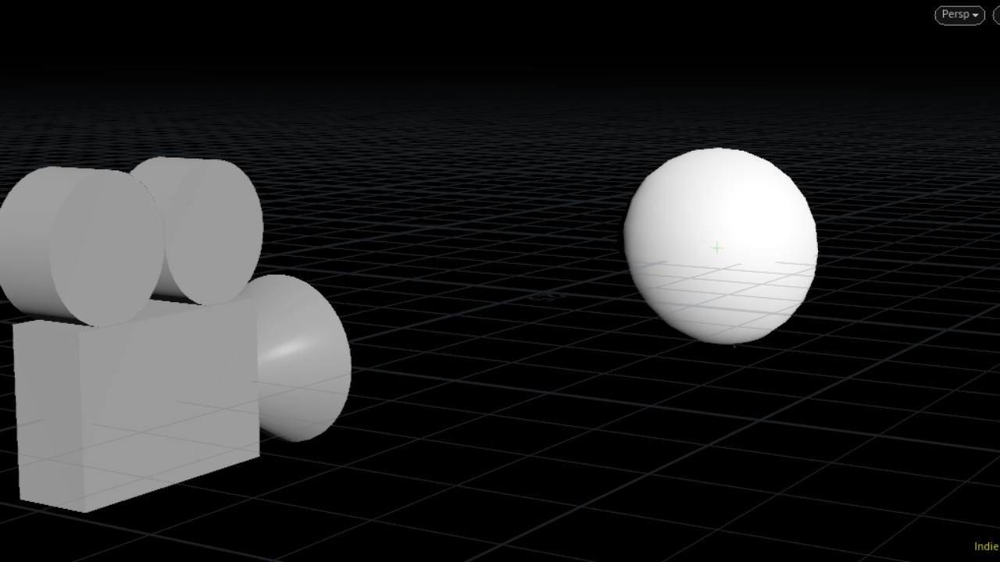
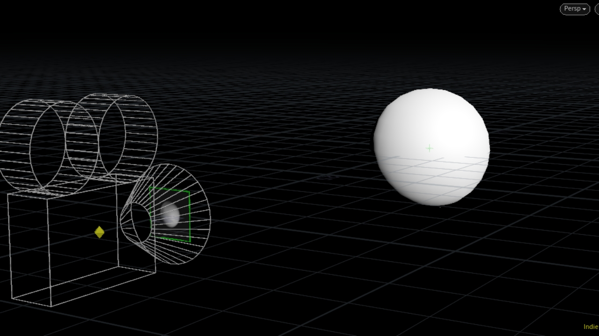
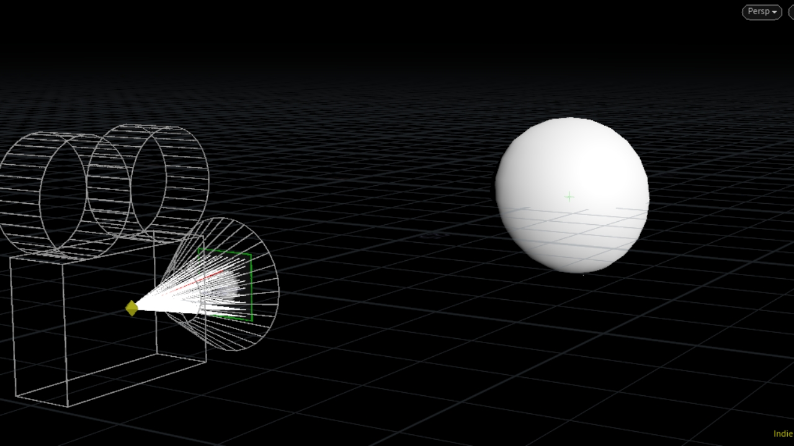
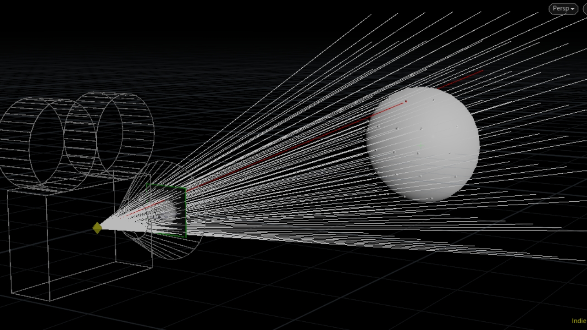
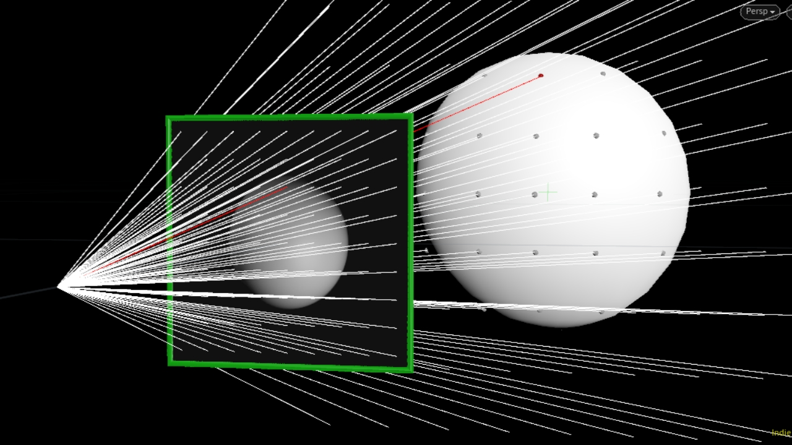

# RayMarching Tutorial

左下のカメラで右の球を撮りたい

カメラの中身はこんな感じ。
カメラ内のある点からイメージセンサーの各画素に向けて線を発射するイメージ。

各線を延長して、シーン内のどこと交差するかをみる。

交差した点の色の情報を画素に転写すると画像がレンダリングできる。
デモでは10 * 10ピクセルでやっているが、どんどんピクセルの数を上げていくと高精細な画像になっていく。